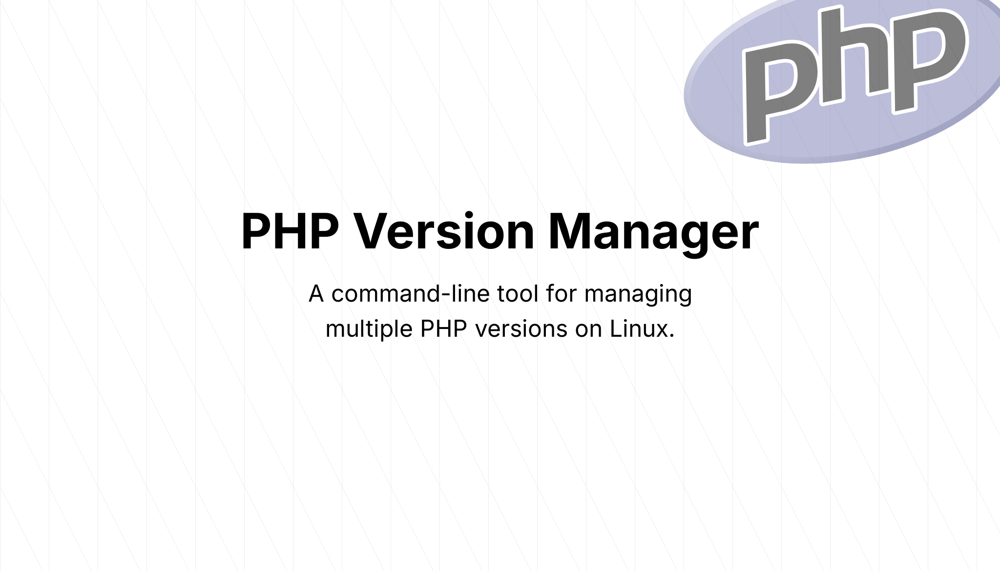

# PHP Version Manager (PVM)


PHP Version Manager (PVM) is a command-line tool for managing multiple PHP versions on Linux. It allows you to easily install, switch between, and manage different PHP versions required for various projects.

## Features

- **Install PHP Versions**: Easily download, compile, and install different PHP versions.
- **Switch PHP Versions**: Switch between installed PHP versions.
- **List Installed Versions**: View all the PHP versions installed on your system.

## Installation

1. Clone the repository:
   ```bash
   git clone https://github.com/your-repo/pvm.git
   cd pvm
   ```

2. Install dependencies:
   ```bash
   npm install
   ```

3. Build the executable:
   ```bash
   npm run build
   ```
    This will create a binary file named `pvm`

4. Move the binary to your local bin directory:
   ```bash
   npm run set-path
   ```
    This will move the `pvm` binary to the `/usr/local/bin` directory.

## Usage

### Install a PHP Version
To install a specific PHP version, use the following command:
```bash
pvm install <version>
```
Example:
```bash
pvm install 8.0.3
```
This will download, compile, and install PHP 8.0.3 on your system.

### Switch PHP Version
To switch to a specific PHP version:
```bash
pvm use <version>
```
Example:
```bash
pvm use 7.4.16
```
This will set PHP 7.4.16 as the current active version.

### List Installed PHP Versions
To list all the installed PHP versions:
```bash
pvm list
```
This will display all PHP versions installed on your system and indicate the currently active version.

## Configuration

PVM uses a `config.json` file to manage default settings, such as the list of extensions to install with each PHP version. The `config.json` file is automatically created in the `.pvm` directory when you run PVM for the first time. You can modify the default extensions by editing this file.

### Example `config.json`:
```json
{
  "default-extensions": [
    "--with-mysqli",
    "--with-pdo-mysql",
    "--enable-mbstring",
    "--with-openssl",
    "--with-curl"
  ]
}
```

## Uninstalling PHP Versions

To uninstall a PHP version, simply remove the directory from the `.pvm` folder:
```bash
rm -rf ~/.pvm/php-<version>
```

## Contributing

Feel free to contribute by submitting issues, fork the repository, or send pull requests!

## License

This project is licensed under the MIT License.
